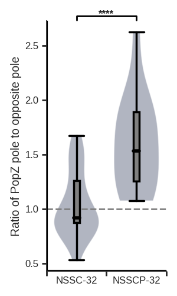
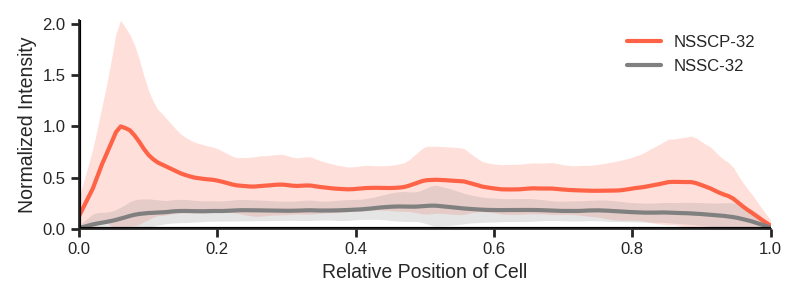

# SynPolarityAnalysis
Image data analysis of synthetic unipolarity in E. coli


`SynPolarityAnalysis` is a Python script for analyzing spatial organizing protein distribution in bacterial cell. 

- [Overview](#overview)
- [System Requirements](#system-requirements)
- [Installation Guide](#installation-guide)
- [Data Acquisitions](#data-acquisitions)
- [Data Input](#data-input)
- [Execute Data Analysis](#execute-data-analysis)
- [Demo](#demo)
- [License](#license)


# Overview
Our script serves as an interface containing self-defined scores and statistical tools to visualize the characteristics of spatial features such as polarity. The software Oufti is required to convert the image data into MATLAB structure array and save in `.mat` files. Our script serves as an interface containing tools to visualize the characteristics of spatial features such as polarity.

# System Requirements

## Software requirements
### OS Requirements
The scripthas been tested on the following systems:
+ Windows: Microsoft Windows 10 Home (1903)
+ Linux: Centos Linux 7 (core)

### Oufti: an open-source software
For exporting `.mat` files from microscopy data, Oufti is essential for users to obtain information of single bacterial cells. The software is free to download from [https://oufti.org/download/register.php](https://oufti.org/download/register.php) in which minimal MATLAB runtime is provided. To understand more uses based on Oufti, please visit [https://oufti.org/tutorial.htm](https://oufti.org/tutorial.htm).

### Python Dependencies
The scientific-related packages are imported and applied by our analysis scripts.
```
numpy
scipy
pandas
matplotlib
seaborn
```

# Installation Guide:

## Install from Github
```
git clone https://github.com/dwgoblue/SynPolarityAnalysis.git
```

# Data Acquisitions

## Raw Data Acquisitions
You need to follow the following workflow to ensure correct analysis. 
- Load phase contrast images into Oufti as channel 0.
- Load fluorescence signals with unipolar protein, e.g. PopZ, as channel 1.
- Load fluorescence signals into channel 2 from the proteins with or without the controls of the unipolar protein, such as SpmX and DivIVA in our paper.

Once finished, cells could be isolated manually or automatically which initiates a structure array to record information of each cell. The next step is to reuse meshes which records the positions of cells in order to extract fluorescent signals. We recommend visit the Oufti instructions (https://oufti.org/application.htm) and get more details about the uses of Oufti.

## Time-lapse data acquisitions
The procedure to analyze time-lapse images is similar to the process for snapshot images. Specifically, the recordings have to be separated by time points. It is noted that the images can only contain one cell and its daughter cell if you plan to analyze single cell division e.g. kymograph. More importantly, one folder must contain one cell data, and the name of the `.mat` files must stick to the series of time points. For example, time-lapse `.mat` files of a cell with `ID:1` have to be put in the same folder and. The files inside the folder are named `1`, `2`, `3` if the files are recorded at three sequential time points.
```
.
+-- [Jul72020]TimeLapseData
+-- Cell1
|   +-- 1.mat
|   +-- 2.mat
|   +-- 3.mat
+-- Cell2
|   +-- 1.mat
|   +-- 2.mat
|   +-- 3.mat
...
```

# Data Input

There are two ways that you can inform the program where the files are for analysis:

1. You are able to add a new function block in `DataInput.py` for which here provides a template.
```
def fig1a():

	parent_path = r'you_path'

	# If every channel is separated, np.array(['TwoInOne']) should be added in the list.
	# If there is no PopZ or other controller protein in channel one, np.array(['NP']) should be added in the list.
	group1 = [np.array(['TwoInOne']), np.array(['NP'])]
	group2 = [np.array(['TwoInOne'])]

	# File names are named by their ID.
	for mark in ['01', '02', '03']:
		img = np.array(['CTRL-{}.mat'.format(mark)])
		group1.append(img)

	for mark in ['01', '02', '03']:
		img = np.array(['EXP-{}.mat'.format(mark)])
		group2.append(img)
		
	# Name of each group.
	labels = np.array(['CTRL', 'EXP'])

	Data = {}
	Data['parent_path'] = parent_path
	Data['exp'] = exp
	Data['labels'] = labels

	return Data
```
2. The second way is to create or edit `DataInput.txt`. In the file, you are asked to fill out the table like the example below.
```
=======================================================
parent_path:/home/user/data
input_mode:file
group_number:3
channels:2;2;2
PopZ:Y;Y;Y
labels:Red;Blue;Green
name_1:Red1.mat;Red2.mat
name_2:Blue1.mat;Blue2.mat
name_3:Green1.mat;Green2.mat
=======================================================
```
- `parent_path`: The script should be able to access the folder of "all" data by the path. Absolute path is recommended.
- `input_mode`: The type of inputs in `name_N` can be files or a folder. That is, you can enter `folder` in this field instead.
- `group_number`: Please write down how many groups are used for analysis which should correspond to the number of `name_N`.
- `channels`: It depends on how many channels of fluorescence are recorded in your `.mat` files. Please type 
- `PopZ`: To inform the script whether the group has the expression of the unipolar protein PopZ, `Y` (YES) or `N` (NO) is entered into this field. It is also applicable if you are using other protein with similar behaviors.
- `labels`: Name of each group. You may want to show a concise name for an experimental group on figures.
- `name_N`: Exact names of files or folders. You may want to add a new `name_N` field if there are more groups. Noted that `N` should be strictly follow the sequence of numbers.

The next section will introduce how to execute the analysis by these two strategies.

# Execute Data Analysis
The script offers four pipelines to analyze microscopy data converted from Oufti, including 
```
PopZOnlyPipline 
DiffuseSignalPipline
TwoChannelPipline
TimeLapsePipline
```
## PopZ-only Data
If there is only one channel which is PopZ signal saved in the `.mat` file, we can apply the `PopZOnlyPipline` in which `tot` (total intensity) and `pks` (peak score) analysis are offered. Here is an example to call the function.
```
from Piplines import*
Starter = PiplinesObj(fig2j,
                      TimeLapse=False,
                      columns=[(0,1)])
Starter.TwoChannelPipline(plots=['tot'])
```
###Signals Recorded from Diffusible Protein
If you are not assumed the protein with spatial patterns, and there is only one channel saved in the `.mat` file, we can apply the `DiffuseSignalPipline` in which `tot-box` (total intensity with boxplot) and`tot-box` (total intensity with violinplot) analysis are offered. Here is an example to call the function.
```
from Piplines import*
Starter = PiplinesObj(fig2j,
                      TimeLapse=False,
                      columns=[(0,1)])
Starter.DiffuseSignalPipline(plots=['tot-box'])
```

## Signals recorded in two or more channels
If you are not assumed the protein with spatial patterns, and there is only one channel saved in the `.mat` file, we can apply the `DiffuseSignalPipline` in which `tot-box` (total intensity with boxplot) and`tot-box` (total intensity with violinplot) analysis are offered. Here is an example to call the function.
```
from Piplines import*
Starter = PiplinesObj(fig2j,
                      TimeLapse=False,
                      columns=[(0,1)])
Starter.TwoChannelPipline(plots=['tot'])
```
To analyze the linescans of two profiles, however, it requires an additional input which is the labels of the select groups.
```
Starter.TwoChannelPipline(plots=['twoprofiles'],
                          twoselect=['NSSCPG', 'NSSCG'])
```
Because Oufti only offers two channels for analysis, you may want to combine two files together if there are three types of fluorescence. For this scenario, we need to ask the function to analyze two files shared the same PopZ (or other controller protein) channel. Thus, the additional input contains the indices of the files that should be bound together.
```
Starter.TwoChannelPipline(plots=['pearson'],
                          FPextension=[1, 2])
```
Moreover, the function offers choices `tot`, `pearson`, `ps`, `lr`, `twoprofile`, `ms`, `trace` and `statprofile` for analysis.

## Time-lapse Data
After rearranging files and folders following to the rules mentioned in the previous section, you are able to execute the analysis for time-lapse data.
```
from Piplines import*
Starter = PiplinesObj(TL_Exp, TimeLapse=True)
Starter.TimeLapsePipline()
```
## Execute the script based on `DataInput.txt`
If you choose to introduce the input files via the `DataInput.txt`, the following code block is recommended. Noted that the path fed into the function indicates the location of the `.txt` file.
```
from Piplines import*
Starter = PiplinesObj(TL_Exp, TimeLapse=True)
Starter.TimeLapsePipline()
```

# Demo
In this section, we will go through an example analysis process step by step. Hopefully, the information could provide a guidance of how to use the script.

## Folder Structure
While the location of data could be change, the relative path of each script must be maintained the same as the structure below.
```
.root
+-- PlotFunc.py
+-- Piplines.py
+-- ReadDataFunc.py
+-- AnalysisFunc.py
+-- DataInput.py
+-- AdditionalFunc.py
+-- DataInput.txt
+-- Demo_notebook.ipynb
+-- Demo_exe.py
+-- Demo
| +-- [Demo]DataInput_folder.txt
| +-- 32NSSC
  | +-- 32NSSC.mat
| +-- 32NSSCP
  | +-- 32NSSCP.mat
...
```
## Edit the `DataInput.txt`
To indicate where the data is and other essential information for running analysis, we have to change the content of the `.txt` file. Here, we provide an example file in the `Demo` folder, `[Demo]DataInput_folder.txt`, in which "folder" mode is implemented. 
```
+++++++++++++++++++++++++++++++++++++++++++++++++++++++
parent_path:./Demo
input_mode:folder
group_number:2
channels:2;2
PopZ:N;Y
labels:NSSC-32;NSSCP-32
name_1:32NSSC
name_2:32NSSCP
+++++++++++++++++++++++++++++++++++++++++++++++++++++++
```
Because red and green fluorescence were recorded in the files, we entered `2` for the field of channels. However, there was no PopZ expressed in the group of `NSSC-32` which should be marked by `N` in the `PopZ` field.

## Initiation of analysis
Before running the script, we have to modify the code block of the main program in `Demo_notebook.ipynb` or `Demo_exe.py`.
```
from Piplines import*

# Apply absolute path if needed.
path = r'./Demo/[Demo]DataInput_folder.txt'

# Change the first input from _ to "" in older version.
Starter = PiplinesObj(_, TimeLapse=False,
                      columns=[(0,1)],
                      mode='txt',
                      txt_path=path)
                      
# Analysis of LR ratio and two-profiles comparison.
Starter.TwoChannelPipline(plots=['lr', 'twoprofiles'],
                          twoselect=['NSSCP-32', 'NSSC-32'])
``` 
If `Demo_notebook.ipynb` is chosen to run the demo, please initiate Jupyterlab or Jupyter notebook. After that, the code block of analysis is capable of running. 
```
(Terminal)$Jupyter-lab
```
Alternatively, you could simply execute the analysis with `Demo_exe.py`. In the terminal, you can run the script by the command below.
```
(Terminal)$cd [the path to access the Demo folder]
(Terminal)$python3 ./Demo_exe.py
```
If it works, the output should be
```
Start to process the group of NSSC-32 .
Processing 30 cells in signal0.
Processing 30 cells in signal1.
Start to process the group of NSSCP-32 .
Processing 29 cells in signal0.
Processing 29 cells in signal1.
The group NSSC-32 has n= 30 after unipolar PopZ selection.
The group NSSC-32 has n= 30
The group NSSCP-32 has n= 15 after unipolar PopZ selection.
The group NSSCP-32 has n= 15
ttest_ind:            t = -6.59319  p = 5.01037e-08
The analysis is finishing.
```
Finally, the figures are saving in the `./Demo` folder which should be the same as the results below.


<p align="center">
  
</p>
<p align="center">
Figure 1. The ratio between two poles.
</p>


<p align="center">
  
  Figure 2. The comparison between two profiles.
</p>

# License

This project is covered under the **Apache 2.0 License**.